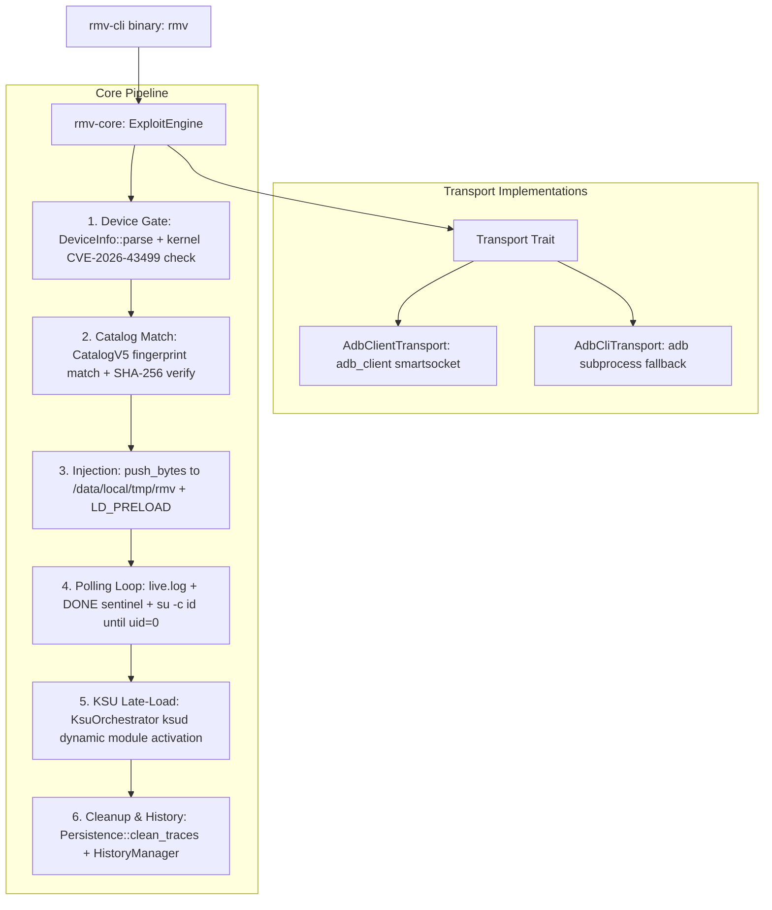

# Repository Guidelines

## Project Overview

`RootMyVivo-rs` is a cross-platform, pure-Rust toolchain providing unlock-free temporary root and KernelSU/SukiSU LKM late-loading for bootloader-locked vivo/iQOO devices exploiting CVE-2026-43499.
The project connects to target devices via pure-Rust ADB protocol:
- **Primary Transport**: Pure-Rust Smartsocket client (`adb_client`) connecting to local ADB server daemon with automatic background server lifecycle management.
- **CLI Fallback**: `AdbCliTransport` for direct CLI subprocess failover.

---

## Architecture & Data Flow



### Data Flow Invariants
1. **Device Gate**: `/proc/version` kernel version $\ge$ 6.6.140 is patched; the engine halts immediately (`GateStatus::Patched`).
2. **Payload Selection**: Matched strictly by kernel build fingerprint (`abogki*`), never by consumer device marketing name alone.
3. **KSU Timing**: `ksud late-load` runs *immediately* upon obtaining `uid=0` while exploit daemon pipes survive. Once KernelSU driver activation is verified in `/proc/modules`, root calls route to `/system/bin/su`.
4. **Device Footprint**: every rmv-owned device artifact lives under `/data/local/tmp/rmv` (`preload.so`, `ksud`, `live.log`, `DONE`, transient `manager_temp.apk`), so device-side teardown is a single directory sweep.
5. **History Retention**: Real runs record the last 50 execution logs to `~/.rmv/history/<timestamp>_<id>.json`. Dry runs (`--dry-run`) **never** write history.

---

## Key Directories

- `crates/rmv-core/`: Core library housing the exploit pipeline, vulnerability/catalog gates, KernelSU orchestration, and all transport implementations (`usb`, `wifi`, `cli`).
- `crates/rmv-cli/`: Desktop terminal binary (`rmv`) providing command dispatch, argument parsing, and interactive terminal UI.

---

## Development Commands

### Building
```bash
# Build desktop CLI binary (debug)
cargo build --bin rmv

# Build optimized release binary
cargo build --release --bin rmv

# Check entire desktop workspace
cargo check --workspace


### Testing
```bash
# Run all workspace unit tests
cargo test --workspace

# Run tests for rmv-core only
cargo test -p rmv-core

# Run specific test by substring filter
cargo test -p rmv-core spake2
cargo test -p rmv-core test_format_epoch_seconds
```

### Running CLI Commands
```bash
# Check connected device status (auto-detects USB, Wi-Fi mDNS, or CLI)
cargo run --bin rmv -- check -t auto

# Direct USB inspection (pure Rust, bypasses adb.exe)
cargo run --bin rmv -- check -t usb

# Pair with Android 11+ Wireless Debugging
cargo run --bin rmv -- pair 192.168.1.50:37123 876543

# Run exploit in simulation mode (no files sent, no history polluted)
cargo run --bin rmv -- run -p /path/to/preload.so --dry-run

# Sweep device-side artifacts (single full clean; there is no --deep flag)
cargo run --bin rmv -- clean -t cli
```

`rmv clean` always runs the full sweep: it cleans `/data/local/tmp/rmv` (payload, `ksud`, `live.log`, `DONE`), any legacy payload residue at the tmp root (`preload.so`, `su`, `temp_su.sock`, `su_daemon.log`, `temp_su.pid`, `exploit_run.log`), `/data/adb/rmv`, and stale `su --daemon` processes. It never touches `/system/bin/su`, KSU modules, or third-party entries under `/data/local/tmp` — the `chown` is **non-recursive** on purpose, and the `su --daemon` match uses the `[s]u` bracket trick so `pkill` cannot kill the shell running it.

---

## Code Conventions & Common Patterns

### Status Message Formatting
Terminal messages must use standardized, clean ASCII status prefixes without decorative emojis or full-width punctuation:
- `[ .. ]`: In-progress operation (cyan)
- `[ ok ]`: Successful step (green)
- `[warn]`: Non-fatal warning / degradation (yellow)
- `[fail]`: Failure / error (red)
- `[info]`: Informational detail (cyan/dimmed)

### Error Handling
- **Core Library (`rmv-core`)**: All errors use `rmv_core::RmvError`. Do not use `anyhow` inside `rmv-core`. Implement `Display` by mapping each variant to a `rust_i18n::t!` translation key.
- **CLI Layer (`rmv-cli`)**: Handlers in `commands/mod.rs` return `anyhow::Result<()>`, wrapping core errors with `.context(...)`.

### Async & Trait Patterns
- The `Transport` trait uses standard async trait bounds:
  ```rust
  #[async_trait]
  pub trait Transport: Send + Sync { ... }
  ```
- Any component accepting `<T: Transport>` automatically accepts `Arc<dyn Transport>` via the blanket delegation implemented in `transport/mod.rs`.

### Localization (i18n)
- Every user-facing message must reside in both `crates/rmv-core/locales/en.json` and `crates/rmv-core/locales/zh-CN.json`.
- Access translations using `rust_i18n::t!("key.path", arg = value)`.
- Command-line arguments in `rmv-cli` are dynamically translated via `localize_command` in `main.rs`.


## Testing & QA

- **Unit Testing**: 16 unit tests reside in inline `#[cfg(test)] mod tests` blocks within `rmv-core` (`catalog.rs`, `device.rs`, `history.rs`, `ksu.rs`, `wifi/pairing.rs`).
- **Regression Gates**:
  - `cargo test --workspace` must pass with 0 failures before any pull request or commit.
