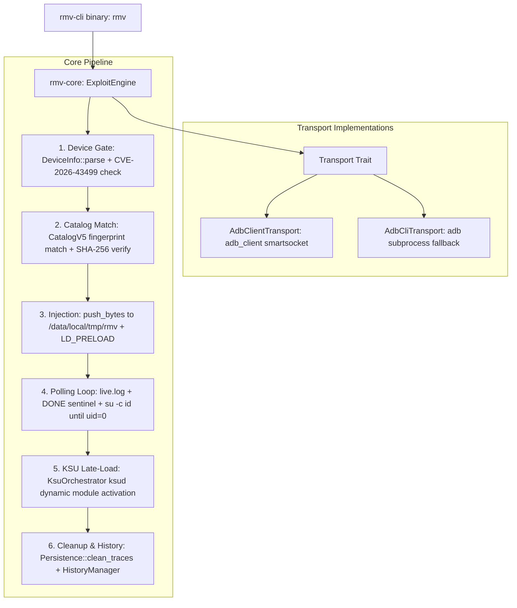

# RootMyVivo-rs

[](https://doc.rust-lang.org/edition-guide/rust-2021/)
[](Cargo.toml)
[](https://github.com/zenyxx-xd/RootMyVivo)
[](Cargo.toml)

A cross-platform, pure-Rust toolchain providing **unlock-free temporary root** and **KernelSU / SukiSU LKM late-loading** for bootloader-locked vivo and iQOO devices exploiting **CVE-2026-43499**.

`RootMyVivo-rs` connects to target devices via pure-Rust ADB protocol:
- **Primary Transport**: Pure-Rust Smartsocket client (`adb_client`) connecting to local ADB server daemon with automatic background server lifecycle management.
- **CLI Fallback**: `AdbCliTransport` for direct CLI subprocess failover.

---

## Architecture & Data Flow



---

## Key Features

- **Dual Transport Backends**: a pure-Rust Smartsocket client (`adb_client`) talking to the local ADB server, with automatic fallback to the `adb` CLI subprocess.
- **Smart Root Status & Process Liveness Detection**: Single-roundtrip probe surveys active kernel modules, canonical su paths, process maps, and sentinel files. If the device already has root, the exploit stage is automatically skipped to prevent kernel panic from redundant injection.
- **Cascading su Resolution**: Polling probe cascades through available su binary paths (`/system/bin/su` || `/data/local/tmp/su` || `su`) to ensure instant detection once root privileges become active.
- **Multi-tier Remote Catalog & Local Mirrors**: Dynamically resolves payload catalogues across four tiers (`--catalog-url` CLI flag > `RMV_CATALOG_URL` env var > `~/.rmv/catalog_url` persistent config > official GitHub & jsDelivr mirrors).
- **Strict Kernel Fingerprinting**: Payloads are matched strictly against kernel build fingerprints (`abogki*`), never by consumer marketing names alone.
- **Minimal Device Footprint**: Payloads operate strictly under `/data/local/tmp/rmv` without modifying system partitions or creating fragile filesystem mounts.
- **Complete Trace Teardown**: `rmv clean` restores stock runtime state, sweeps `/data/local/tmp/rmv`, `/data/adb/rmv`, and terminates orphaned payload daemons.
- **Bilingual Interface**: Full localization in Simplified Chinese (`zh-CN`) and English (`en`), dynamically selecting system locale or manual `-L` override.

---

## Workspace Crates

| Crate | Target | Description |
|---|---|---|
| `crates/rmv-core` | Desktop | Core engine, exploit pipeline, transports (`usb`, `wifi`, `cli`), catalog resolution, and KernelSU orchestration. |
| `crates/rmv-cli` | Desktop | Terminal binary (`rmv`) providing interactive CLI dispatch, live progress bars, and localized commands. |

---

## Building & Installation

### Prerequisites

- [Rust Toolchain](https://rustup.rs/) (1.80+ recommended, 2021 edition)

### Build CLI Binary

```bash
# Debug build
cargo build --bin rmv

# Optimized release binary
cargo build --release --bin rmv
```

The compiled binary will be located at `target/release/rmv` (or `target/release/rmv.exe` on Windows).

### Run Test Suite

```bash
# Run all workspace unit tests (42 tests across rmv-core, engine_test, and rmv-cli)
cargo test --workspace


---

## Usage Guide

```text
A lightweight tool to acquire unlock-free temporary root, load KernelSU, and configure local ADB on vivo/iQOO devices with locked bootloaders.

Usage: rmv [OPTIONS] <COMMAND>

Commands:
  check    Inspect connected device and verify vulnerability status
  catalog  Fetch, configure, and match payloads from remote catalog
  pair     Pair with Android 11+ wireless debugging using pairing code
  run      Acquire temporary root and load KernelSU
  clean    Clean up temporary runtime files on device
  history  View or manage execution history logs
  help     Print help for command or subcommand
```

### 1. Inspect Device & Root Status (`rmv check`)

Auto-detects USB, Wi-Fi, or CLI transport, prints kernel identifiers, CVE gate status, and current root privilege state:

```bash
rmv check
```

**Example Output:**
```text
Connecting to device...

Device Information
  Device      : PD2408
  Model       : V2408A
  Brand       : vivo
  Kernel      : Linux 6.6.89
  GKI Build   : g1f71897ac249
  Fingerprint : abogki467805059
  Boot ID     : 50c209e2-1c87-45d5-9019-c103468768c3
  Root Status : KernelSU Live (/system/bin/su)

  Status      : Supported (CVE-2026-43499 unpatched)
```

### 2. Manage Remote Payload Catalog (`rmv catalog`)

`RootMyVivo-rs` supports custom remote catalog mirrors, ideal for private mirrors, offline testing, or third-party device entries:

```bash
# Show currently active catalog URL and configuration source
rmv catalog show

# Configure and persist a custom remote catalog URL (saved to ~/.rmv/catalog_url)
rmv catalog set https://my-custom-mirror.com/catalog/devices.json

# Reset back to official default catalog
rmv catalog reset

# Match connected device against catalog (or one-off custom URL)
rmv catalog
rmv catalog --catalog-url https://example.com/devices.json
```

> [!TIP]
> You can also override the catalog URL globally via the `RMV_CATALOG_URL` environment variable without touching local configuration files.

### 3. Pair Android 11+ Wireless Debugging (`rmv pair`)

Discovers wireless-debugging endpoints over mDNS (`mdns-sd`) and performs the Android pairing handshake through the local ADB server:

```bash
# Enter pairing IP:Port and 6-digit code shown in Developer Options
rmv pair 192.168.1.50:37123 876543
```
Pairing state lives in the local ADB server key store, so later sessions authenticate without re-pairing.

### 4. Execute Exploit & Load KernelSU (`rmv run`)

```bash
# Full automatic run (fetches matching payload, injects, and loads SukiSU Ultra)
rmv run

# Run with a local custom preload.so
rmv run -p /path/to/preload.so

# Select specific KernelSU variant (sukisu, kernelsu, next, resukisu)
rmv run --ksu next

# Simulation mode (verifies and resolves payload without pushing files or altering device)
rmv run --dry-run
```

> [!NOTE]
> If `rmv run` detects that KernelSU or a temporary root daemon is already active, it will automatically skip redundant payload injection to eliminate kernel slab poisoning risks.

### 5. Clean Device Residues (`rmv clean`)

Sweeps all injection and runtime traces from the device:
- Removes `/data/local/tmp/rmv` (`preload.so`, `ksud`, `live.log`, `DONE`).
- Cleans legacy root residues (`/data/local/tmp/su`, `/data/local/tmp/temp_su.sock`, `su_daemon.log`).
- Safely terminates stale `su --daemon` processes using brackets pattern matching (`[s]u`).
- Unmounts any lingering tmpfs overlays to restore pristine stock runtime state.
```bash
rmv clean
```

### 6. History Management (`rmv history`)

```bash
# List last 15 run records
rmv history

# Show full execution logs of a run
rmv history show <RECORD_ID>

# Clear all historical logs
rmv history clear
```

---

## Transport Selection

Specify the transport backend using the `-t` / `--transport` flag:

```bash
# Automatic resolution (local ADB server first, adb CLI subprocess as fallback)
rmv -t auto check

# Force the pure-Rust Smartsocket client against the local ADB server
rmv -t client check

# `usb` and `wifi` are accepted aliases for `client`
rmv -t wifi check

# Force the external adb.exe subprocess
rmv -t cli check
```

---

## Vulnerability & Compatibility Gate

`RootMyVivo-rs` evaluates CVE-2026-43499 patch status during device discovery:

| Kernel Series | Vulnerable (Exploitable) | Patched (Execution Halted) |
|---|---|---|
| **Linux 6.6** | `< 6.6.140` | $\ge$ `6.6.140` or backport commit `g24b70dd1cb81` |
| **Linux 6.1** | `< 6.1.145` | $\ge$ `6.1.145` |
| **Linux 6.12** | `< 6.12.86` | $\ge$ `6.12.86` |

> [!WARNING]
> On devices running patched kernels, the engine will halt immediately with `GateStatus::Patched` to avoid triggering kernel panics or instability.

---

## Acknowledgements

`RootMyVivo-rs` would not be possible without the foundational research, tools, and infrastructure created by the upstream `RootMyVivo` open-source ecosystem and its contributors:

- **[zenyxx-xd/RootMyVivo](https://github.com/zenyxx-xd/RootMyVivo)**: Upstream Android host application, Shizuku integration, and device orchestration architecture.
- **[zenyxx-xd/RootMyVivo-Payloads](https://github.com/zenyxx-xd/RootMyVivo-Payloads)**: Central payload distribution repository, catalog v5 specification (`catalog/devices.json`), and binary mirrors.
- **[zenyxx-xd/RootMyVivo-Exploit](https://github.com/zenyxx-xd/RootMyVivo-Exploit)**: Hardened CVE-2026-43499 (GhostLock futex PI UAF) injection payload source tree.
- The broader KernelSU, SukiSU, and Android kernel vulnerability research community.

---

## Disclaimer

This tool is developed for security research, kernel vulnerability verification, and authorized hardware maintenance on owned devices only. Root permissions grant full access to system subsystems; use responsibly.
