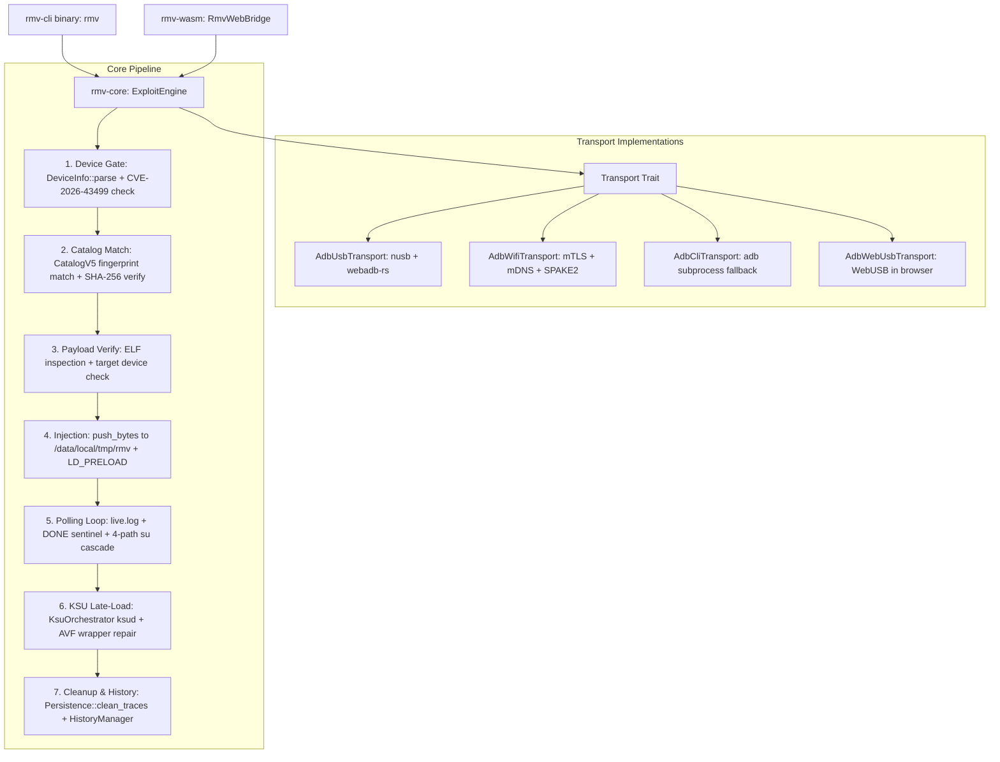

# rootmyvivo-rs

[](https://doc.rust-lang.org/edition-guide/rust-2021/)
[](Cargo.toml)
[](https://github.com/zenyxx-xd/RootMyVivo)
[](Cargo.toml)

A cross-platform, pure-Rust toolchain providing **unlock-free temporary root** and **KernelSU / SukiSU LKM late-loading** for bootloader-locked vivo and iQOO devices exploiting **CVE-2026-43499**.

`rootmyvivo-rs` completely eliminates external runtime dependencies on Google's `adb.exe` binary:
- **Desktop (Windows / Linux / macOS)**: Direct hardware communication via pure-Rust USB (`nusb`) and Android 11+ Wireless Debugging (`rustls` TLS 1.3 + mDNS + SPAKE2 pairing).
- **Web (Browser / WebAssembly)**: Client-side WebUSB via `rmv-wasm` compiling to `wasm32-unknown-unknown`.
- **Legacy Fallback**: Automatic failover to `AdbCliTransport` when an ADB server daemon is already running.

---

## Architecture & Data Flow



---

## Key Features

- **Zero ADB Dependency**: Native USB driver (`nusb`) and native Wi-Fi debugging client (`rustls` + SPAKE2) compiled directly into the binary.
- **Smart Root Status & Process Liveness Detection**: Single-roundtrip probe (`ROOT_PROBE_CMD`) surveys `/proc/modules`, `/system/bin/su`, `/data/local/tmp/su`, `/apex/com.android.virt/bin/su`, process maps, and sentinel files. If the device already has root, the exploit stage is automatically skipped to prevent kernel panic from redundant injection.
- **Cascading su Resolution**: Polling probe cascades through four paths (`/system/bin/su` || `/data/local/tmp/su` || `/apex/com.android.virt/bin/su` || `su`) to ensure instant detection even when standard `su` is masked by stale wrappers.
- **Multi-tier Remote Catalog & Local Mirrors**: Dynamically resolves payload catalogues across four tiers (`--catalog-url` CLI flag > `RMV_CATALOG_URL` env var > `~/.rmv/catalog_url` persistent config > official GitHub & jsDelivr mirrors).
- **Strict Kernel Fingerprinting**: Payloads are matched strictly against kernel build fingerprints (`abogki*`), never by consumer marketing names alone.
- **AVF Path Self-Healing**: Automatically repairs broken `/apex/com.android.virt/bin/su` tmpfs overlays by deploying a 42-byte forwarding wrapper (`exec /system/bin/su "$@"`) with proper SELinux context (`u:object_r:system_file:s0`).
- **Complete Trace Teardown**: `rmv clean` restores stock AVF binaries, removes `/data/local/tmp/rmv`, `/data/adb/rmv`, and terminates orphaned payload daemons.
- **Bilingual Interface**: Full localization in Simplified Chinese (`zh-CN`) and English (`en`), dynamically selecting system locale or manual `-L` override.

---

## Workspace Crates

| Crate | Target | Description |
|---|---|---|
| `crates/rmv-core` | Desktop & WASM | Core engine, exploit pipeline, transports (`usb`, `wifi`, `cli`), catalog resolution, and KernelSU orchestration. |
| `crates/rmv-cli` | Desktop | Terminal binary (`rmv`) providing interactive CLI dispatch, live progress bars, and localized commands. |
| `crates/rmv-wasm` | `wasm32-unknown-unknown` | WebAssembly bridge exposing WebUSB adb channels for browser-based deployment. |

---

## Building & Installation

### Prerequisites

- [Rust Toolchain](https://rustup.rs/) (1.80+ recommended, 2021 edition)
- (Optional, for WebAssembly) `wasm32-unknown-unknown` target:
  ```bash
  rustup target add wasm32-unknown-unknown
  ```

### Build CLI Binary

```bash
# Debug build
cargo build --bin rmv

# Optimized release binary
cargo build --release --bin rmv
```

The compiled binary will be located at `target/release/rmv` (or `target/release/rmv.exe` on Windows).

### Run Test Suite

```bash
# Run all workspace unit tests (19 unit tests across 5 suites)
cargo test --workspace

# Verify WebAssembly target cleanly compiles without desktop network dependencies
cargo check -p rmv-wasm --target wasm32-unknown-unknown
```

---

## Usage Guide

```text
面向锁定 Bootloader 的 vivo/iQOO 机型，提供全自动免解锁临时提权与 KernelSU 动态加载。

Usage: rmv [OPTIONS] <COMMAND>

Commands:
  check    检测设备信息与漏洞支持状态
  catalog  查询、配置并匹配在线载荷编目
  pair     使用配对码与 Android 11+ 无线调试进行安全配对
  run      执行提权并加载 KernelSU
  clean    清理设备上的临时文件与残留
  history  查看或管理运行历史
  help     打印命令帮助信息
```

### 1. Inspect Device & Root Status (`rmv check`)

Auto-detects USB, Wi-Fi, or CLI transport, prints kernel identifiers, CVE gate status, and current root privilege state:

```bash
rmv check
```

**Example Output:**
```text
正在连接设备...

设备信息
  设备代号 : PD2408
  机型名称 : V2408A
  品牌     : vivo
  内核版本 : Linux 6.6.89
  GKI 构建 : g1f71897ac249
  构建指纹 : abogki467805059
  Boot ID  : 50c209e2-1c87-45d5-9019-c103468768c3
  Root 状态 : KernelSU Live (/system/bin/su)

  支持状态 : 支持 (CVE-2026-43499 未修补)
```

### 2. Manage Remote Payload Catalog (`rmv catalog`)

`rootmyvivo-rs` supports custom remote catalog mirrors, ideal for private mirrors, offline testing, or third-party device entries:

```bash
# Show currently active catalog URL and configuration source
rmv catalog show

# Configure and persist a custom remote catalog URL (saved to ~/.rmv/catalog_url)
rmv catalog set https://my-custom-mirror.com/catalog/devices.json

# Reset back to official default catalog
rmv catalog reset

# Match connected device against catalog (or one-off custom URL)
rmv catalog
rmv catalog --catalog-url https://example.com/devices.json
```

> [!TIP]
> You can also override the catalog URL globally via the `RMV_CATALOG_URL` environment variable without touching local configuration files.

### 3. Pair Android 11+ Wireless Debugging (`rmv pair`)

Bypasses cables entirely by pairing with Android's built-in Wireless Debugging over SPAKE2 and TLS 1.3:

```bash
# Enter pairing IP:Port and 6-digit code shown in Developer Options
rmv pair 192.168.1.50:37123 876543
```
Credentials are encrypted and saved to `~/.rmv/adb_tls/` for automatic authentication in future sessions.

### 4. Execute Exploit & Load KernelSU (`rmv run`)

```bash
# Full automatic run (fetches matching payload, injects, and loads SukiSU Ultra)
rmv run

# Run with a local custom preload.so
rmv run -p /path/to/preload.so

# Select specific KernelSU variant (sukisu, kernelsu, next, resukisu)
rmv run --ksu next

# Simulation mode (verifies and resolves payload without pushing files or altering device)
rmv run --dry-run
```

> [!NOTE]
> If `rmv run` detects that KernelSU or a temporary root daemon is already active, it will automatically skip redundant payload injection to eliminate kernel slab poisoning risks.

### 5. Clean Device Residues (`rmv clean`)

Sweeps all injection and runtime traces from the device:
- Unmounts `/apex/com.android.virt/bin` tmpfs overlays (restoring stock AVF binaries).
- Removes `/data/local/tmp/rmv` (`preload.so`, `ksud`, `live.log`, `DONE`).
- Cleans legacy root residues (`/data/local/tmp/su`, `/data/local/tmp/temp_su.sock`, `su_daemon.log`).
- Safely terminates stale `su --daemon` processes using brackets pattern matching (`[s]u`).

```bash
rmv clean
```

### 6. History Management (`rmv history`)

```bash
# List last 15 run records
rmv history

# Show full execution logs of a run
rmv history show <RECORD_ID>

# Clear all historical logs
rmv history clear
```

---

## Transport Selection

Specify the transport backend using the `-t` / `--transport` flag:

```bash
# Automatic resolution (USB first, mDNS wireless debugging second, CLI fallback third)
rmv -t auto check

# Force pure-Rust USB transport (nusb, bypasses adb.exe)
rmv -t usb check

# Force pure-Rust Wi-Fi transport (mDNS discovery + TLS 1.3)
rmv -t wifi check

# Use external adb.exe subprocess
rmv -t cli check
```

---

## Vulnerability & Compatibility Gate

`rootmyvivo-rs` evaluates CVE-2026-43499 patch status during device discovery:

| Kernel Series | Vulnerable (Exploitable) | Patched (Execution Halted) |
|---|---|---|
| **Linux 6.6** | `< 6.6.140` | $\ge$ `6.6.140` or backport commit `g24b70dd1cb81` |
| **Linux 6.1** | `< 6.1.145` | $\ge$ `6.1.145` |
| **Linux 6.12** | `< 6.12.86` | $\ge$ `6.12.86` |

> [!WARNING]
> On devices running patched kernels, the engine will halt immediately with `GateStatus::Patched` to avoid triggering kernel panics or instability.

---

## Disclaimer

This tool is developed for security research, kernel vulnerability verification, and authorized hardware maintenance on owned devices only. Root permissions grant full access to system subsystems; use responsibly.
